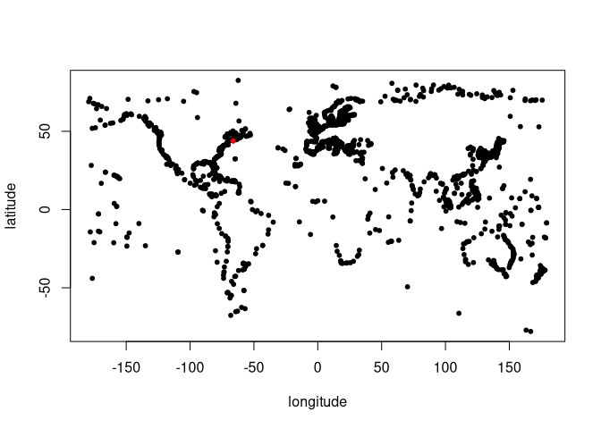
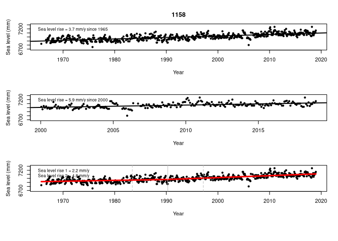

PSMSL sealevel rate of change
=============================

This package queries the PSMSL database (PSMSL 2020) for data from a
station of your choosing, plots the RLR monthly data and determines the
rate of sea level change in mm/year.

Installation
============

    devtools::install_github("duplisea/sealevel")
    library(sealevel)

Using the package
=================

Find a station id based on fuzzy name search
--------------------------------------------

A simple searching function is provided to find stations. PSMSL contains
close to 2000 RLR tide gauge stations globally, this is actually not
that many. A simple dot plot is provided to show you where these
stations are located. In this example we search for Yarmouth keeping in
mind that most nations that were once British colonies probably have a
“Yarmouth” which is probably located at the mouth of a River Yar;
however, in the case, searching “yarm” only finds the Yarmouth in Nova
Scotia, Canada. You will see from the output to the console that its
station id is 1158.

    ##      id      lat      long location coastline station YN
    ## 1: 1158 43.83333 -66.13333 YARMOUTH       970       7  N

Plotting the sea level data from a station
------------------------------------------

So let’s plot the sea level and calculate its rate of change for
Yarmouth (station id 1158). There are few places that have tide level
data &lt;1900 but this old fishing port may actually have some so let’s
set y1 to 1800 just to be sure. Let’s set y2 to 2000 which will then
calculate the rate of sea level rate of change from 2000 until the most
recent year that data was reported.

Three plots come from this

Plot 1: the sea level at the Yarmouth tide station (1158) from the start
of the data (1965) until 2019. A linear regression is fitted to the data
and the slope is the rate of sea level change over that time period. In
this case that is 3.7 mm/y

Plot 2: this is sea level rate of change since 2000 which is 5.9 mm/y

Plot 3: This takes the full time series of data like in Plot 1 but it
fits a segmented regression and determines the breakpoint that explains
the data the best. This has been constrained to fit only 1 breakpoint.
The breakpoint is the vertical solid grey line and its 95% confidence
interval is represented by the vertical dotted lines. The rate of sea
level before and after the breakpoint are calculated and show on the
graph.

Interpretation
==============

I use this to look at the net sea level rise at a location. Because
these are data from fixed tide gauges they simply measure sea level
relative to the land at a location and they do not represent global sea
level change. The rate of sea level change at a location is a function
of local condition which includes glacial rebound rate of the land,
subduction and all those other interesting oceanographic and geologic
phenomena.

In the case of Yarmouth, Nova Scotia, Canada you can see that the sea
has definitely been rising quickly in the past 50 years such that the 50
year average is near to the global present average sea level rise. If
you look just from 2000 onward the sea level in Yarmouth has been rising
at 5.9 mm/y. This is so fast for a couple of reasons:

1.  The Gulf of Maine is a hotspot for sea level rise (Sallenger et
    al. 2012)
2.  2009/10 saw an AMOC low which created a large rise in that period in
    northeastern North America (Ezer 2015)
3.  This part of North America is presently sinking owing to resettling
    after glacial rebound as it was closer to the edge of the Laurentide
    icesheet

Another interesting phenomenon in the decline in sealevel from 1965-1979
shown by the breakpoint regression. This is now at least partially
explicable by the phenomenon of dam building and the creation of huge
reservoirs of water during the great dam building period in the 1960s
and 1970s (Hawley et al. 2020).

References
==========

Ezer, T., 2015. Detecting changes in the transport of the Gulf Stream
and the Atlantic overturning circulation from coastal sea level data:
The extreme decline in 2009–2010 and estimated variations for 1935–2012.
Global and Planetary Change, 129, pp.23-36.

Hawley, W.B., Hay, C.C., Mitrovica, J.X. and Kopp, R.E., 2020. A
Spatially Variable Time Series of Sea Level Change Due to Artificial
Water Impoundment. Earth’s Future, p.e2020EF001497.

PSMSL. 2020. Permanent service for mean sea level.
<a href="https://www.psmsl.org/data/" class="uri">https://www.psmsl.org/data/</a>.

Sallenger, A.H., Doran, K.S. and Howd, P.A., 2012. Hotspot of
accelerated sea-level rise on the Atlantic coast of North America.
Nature Climate Change, 2(12), pp.884-888.
